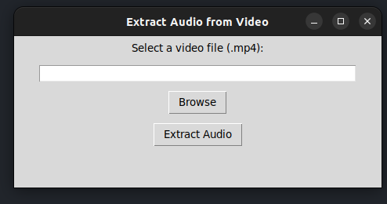
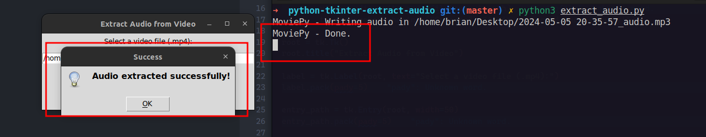

# Video Audio Extractor

This is a simple Python script that uses the `tkinter` library to create a graphical user interface (GUI) allowing users to select a video file (.mp4) and extract its audio track in .mp3 format using the `moviepy` library.

## Requirements

- Python 3.x installed on your system.
- The `tkinter` and `moviepy` libraries must be installed. You can install them using pip:

```bash
pip install tk
pip install moviepy
```

## Execution

To run the script, follow these steps:

1. Clone or download this repository to your local machine.
2. Open a terminal (or command prompt) and navigate to the directory containing the `extract_audio.py` file.
3. Run the script using Python:

```bash
python3 extract_audio.py
```

## Usage

1. Upon running the script, a GUI window will open.
2. Click the "Browse" button to select a video file (.mp4).
3. Once the file is selected, click the "Extract Audio" button to initiate the extraction process.
4. An audio file (.mp3) with the same name as the video file will be created in the same location.

## Screenshots

#### Select file



#### Extract audio successfully




## Notes

- Ensure that video files are compatible with the .mp4 format.
- The extraction process may take some time depending on the size of the video file.
- Extracted audio files will be saved in the same location as the video files, with the suffix "_audio.mp3" added to the file name.


Follow me in social medias and blog for new updates!

### [Instagram](https://www.instagram.com/bscode)
### [Youtube](https://www.youtube.com/@briandevs/videos)
### [TikTok](https://www.tiktok.com/@briansanteliz)
### [Blog](https://codebrian.hashnode.dev/)


Enjoy extracting audio from your videos!
